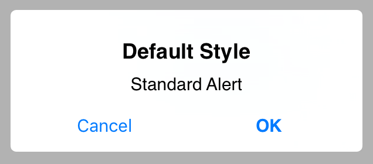

JLAlertView
===========

[](https://developer.apple.com/swift/)
[](https://github.com/skyline75489/SwiftRouter/blob/master/LICENSE)
[](https://travis-ci.org/skyline75489/JLAlertView)
[](https://github.com/Carthage/Carthage)

An UIAlertView replacement written in Swift with a modern chainable API and highly customizable UI, inspired by [SIAlertView](https://github.com/Sumi-Interactive/SIAlertView) and [SweetAlert-iOS](https://github.com/codestergit/SweetAlert-iOS).

## Screenshot



## Requirements

* iOS 9.0 and higher
* Xcode 7.3(Swift 2.2)

## Installation

### CocoaPods(Recommended)

```ruby
pod 'JLAlertView'

use_frameworks!
```

### Carthage

Add this to you `Cartfile`:

    github "skyline75489/JLAlertView"


### Manually

Add `JLAlertView.swift` in your project.

## Usage

```swift
JLAlertView(title: "Default Style", message: "Standart Alert")
.addTextFieldWithConfigurationHandler({ (textField) in
    textField.placeholder = "Username"
})
.addTextFieldWithConfigurationHandler({ (textField) in
    textField.placeholder = "Password"
})
.addButttonWithTitle("Cancel", style: .Cancel, action: nil)
.addButttonWithTitle("OK", action:{(title, alert) in
    let username = alert.textFields[0].text
    let password = alert.textFields[1].text
    print(username)
    print(password)
})
.show()
```

## License

[MIT License](https://github.com/skyline75489/JLAlertView/blob/master/LICENSE)